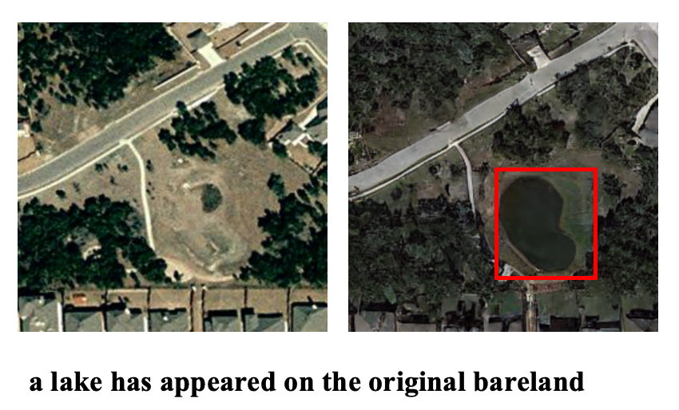
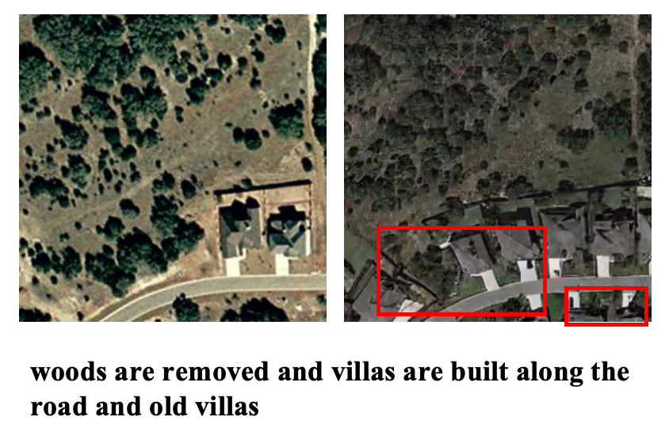
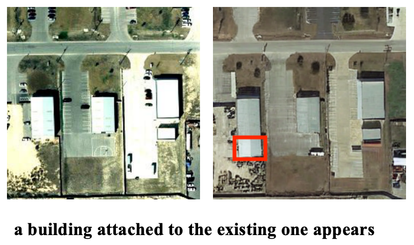
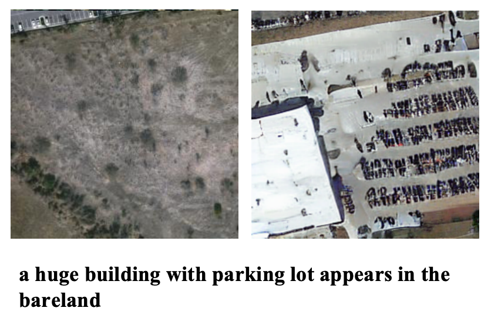
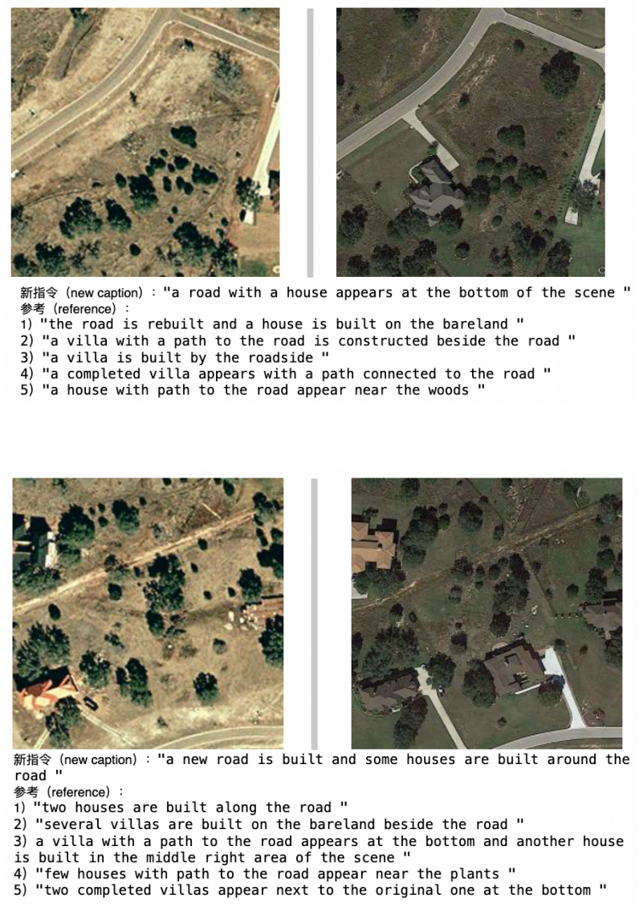
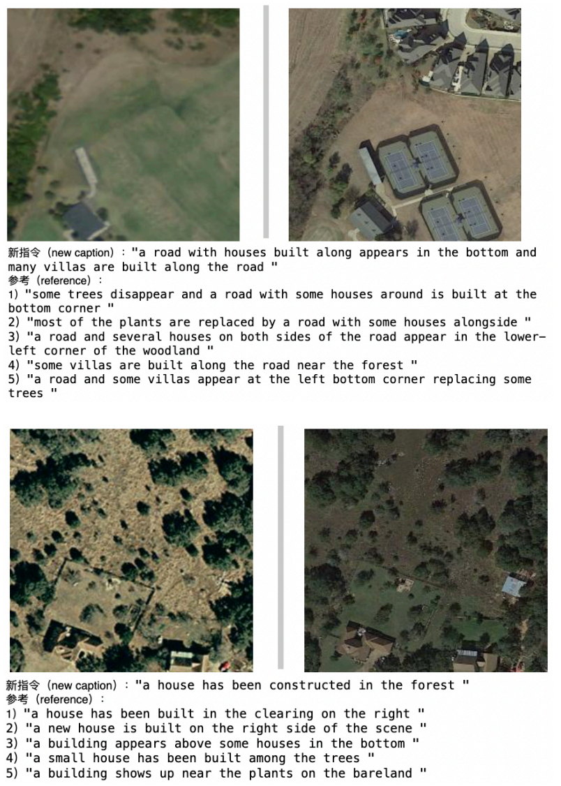
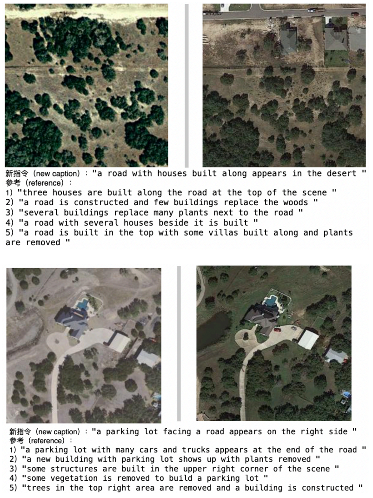

# Remote Sensing Image Editing Based on Diffusion Models

Image editing for dual-temporal remote sensing imagery using diffusion models to generate balanced datasets for remote sensing change captioning.

---

## Overview

This project investigates remote sensing image editing using diffusion models to address the long-tailed distribution of change categories in remote sensing change captioning datasets.

Instead of collecting additional satellite imagery, the project fine-tunes **InstructPix2Pix** to edit remote sensing images according to natural language instructions. The generated image pairs are then incorporated into an expanded training dataset to improve the performance of downstream change captioning models.

This work demonstrates how diffusion-based image editing can be applied as an effective data augmentation strategy for remote sensing applications.


---

## Dataset

This project uses the **Levir-MCI** remote sensing change captioning dataset.

### Dataset Statistics

- 10,077 dual-temporal image pairs
- 256 × 256 RGB images
- Five reference captions for each original image pair
- 5,038 changed image pairs
- 5,039 unchanged image pairs

### Dataset Augmentation

To reduce imbalance among different change categories:

- 1,046 source images were selected from the original dataset
- Five editing instructions were prepared for each selected image
- **5,230 new edited remote sensing images** were generated

After integrating the generated data, the expanded dataset contained **15,307 image pairs**, including 10,268 changed pairs and 5,039 unchanged pairs.

### Dataset Availability

The Levir-MCI dataset is **not redistributed** in this repository.

Users should obtain the dataset from its official source and configure the local dataset path before running the project.

---

## Methodology

The overall workflow is illustrated below.

```text
Original Image
        │
        ▼
Editing Instruction
        │
        ▼
InstructPix2Pix
        │
        ▼
Edited Remote Sensing Image
        │
        ▼
Expanded Dataset
        │
        ▼
RSICCformer
        │
        ▼
Generated Change Caption
```

The project consists of two stages:

### Stage 1 — Remote Sensing Image Editing

The image editing model generates realistic post-change remote sensing images based on textual editing instructions while preserving the unchanged regions of the scene.

### Stage 2 — Change Captioning

The generated image pairs are incorporated into the training dataset and evaluated using **RSICCformer** to assess the impact of dataset augmentation on remote sensing change captioning.

---

## Models

### Image Editing

- Stable Diffusion
- InstructPix2Pix
- DDIM Scheduler
- Classifier-Free Guidance

### Change Captioning

- RSICCformer

---

## Image Editing Examples

The proposed method can generate various realistic scene changes, including:

- Building construction
- Building removal
- Road construction
- Parking lot generation
- Water body generation
- Vegetation changes

while preserving the remaining regions of the original image.

---

## Results

<table>
  <tr>
    <td align="center" width="50%">
      
    </td>
    <td align="center" width="50%">
      
    </td>
  </tr>
  <tr>
    <td align="center" width="50%">
      
    </td>
    <td align="center" width="50%">
      
    </td>
  </tr>
</table>

---

### Quantitative Results


The augmented dataset was evaluated using RSICCformer with standard change captioning metrics.

| Model | BLEU-1 | BLEU-2 | BLEU-3 | BLEU-4 | METEOR | ROUGE-L | CIDEr |
|---|---:|---:|---:|---:|---:|---:|---:|
| RSICCformer | **0.77** | **0.67** | **0.60** | **0.53** | **0.36** | **0.68** | **1.17** |
| MCCFormer-S | 0.74 | 0.63 | 0.55 | 0.49 | 0.34 | 0.64 | 1.04 |
| MCCFormer-D | 0.74 | 0.63 | 0.55 | 0.50 | 0.34 | 0.63 | 1.04 |

The downstream RSICCformer model achieved strong performance across standard change-captioning metrics and outperformed the reported MCCFormer-S and MCCFormer-D baselines.

---

### Change Captioning Examples

The following examples show change captions generated by RSICCformer using the augmented dataset.

<table>
  <tr>
    <td align="center" width="33%">
      
    </td>
    <td align="center" width="33%">
      
    </td>
    <td align="center" width="33%">
      
    </td>
  </tr>
</table>

---

## Repository Structure

```text
remote-sensing-image-editing/
│
├── images/                  # Figures used in README
├── configs/ 
├── scripts/                 # Training and inference scripts
├── src/                     # Core implementation
├── README.md
├── environment.yaml
└── LICENSE
```

> **Note:**  
> The original dataset and trained checkpoints are **not included** in this repository due to licensing restrictions and file size limitations.

---

## Installation

Clone the repository:

```bash
git clone https://github.com/lilithali/remote-sensing-image-editing.git
cd remote-sensing-image-editing
conda env create -f environment.yaml
conda activate ip2p
---

## Pre-trained Models

Pre-trained and fine-tuned model checkpoints are **not included** in this repository.

This is because:

- Model checkpoints are large
- The project builds upon externally released diffusion models
- Those models are distributed under their own licenses and terms

Utility scripts for obtaining required model resources are provided in:

```text
scripts/download_pretrained_sd.sh
scripts/download_checkpoints.sh
---

## Usage

The main implementation is organised under `src/`.

Key entry points include:

- `src/main.py` — main project entry point
- `src/edit_cli.py` — instruction-guided image editing interface
- `src/edit_dataset.py` — batch dataset editing and augmentation
- `src/T2I.py` — text/image generation related utilities
- `src/ClipI.py` — CLIP-related utilities
- `src/convert.py` — data conversion utilities

Model and training configuration is stored in:

```text
configs/train.yaml

### Generate Edited Images

```bash
python inference.py
```

### Dataset Augmentation

```bash
python generate_dataset.py
```

### Evaluate Change Captioning

```bash
python evaluate.py
```


---

## Acknowledgements

This project builds upon several excellent open-source projects and publicly available datasets:

- Stable Diffusion
- InstructPix2Pix
- Hugging Face Diffusers
- Levir-MCI Dataset
- RSICCformer

We sincerely thank the authors for making their work publicly available.

---

## License

This project builds upon InstructPix2Pix and Stable Diffusion.

The original InstructPix2Pix license is included in this repository. Portions of the code and models are derived from the Stable Diffusion codebase and may be subject to additional licensing restrictions.

The Levir-MCI dataset and trained model checkpoints are not redistributed in this repository.
